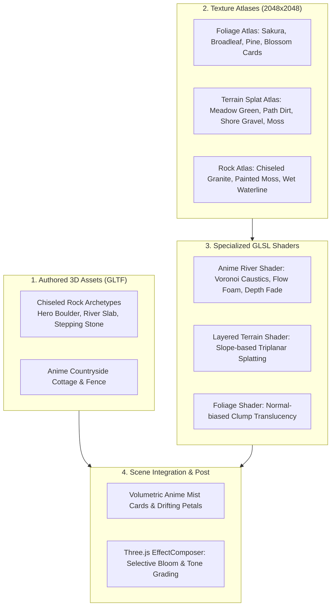

# ANIME RIVER — Phase 2.5: Technical & Visual Audit Report

**Project**: Anime River Hero  
**Phase**: 2.5 — Art Direction Reset & Asset Pipeline Audit  
**Target Reference**: `Reference.png` (Makoto Shinkai / Studio Ghibli painterly aesthetic)  
**Current State Render**: `screenshots/Phase2_Render.png`  
**Execution Guardrail**: Zero modifications committed to active scene files in `src/` during Phase 2.5.

---

## Executive Summary

The current Three.js implementation establishes a strong structural foundation: the diagonal CatmullRom river spline, camera vantage point (`45° FOV`), and spatial distribution of the left meadow plateau versus right bluff are sound. 

However, `screenshots/Phase2_Render.png` visually reads as a **stylized low-poly indie game** rather than a painterly anime landscape. The core cause is an over-reliance on **procedural geometric deformation and flat shading** (e.g. perturbing icospheres and dodecahedrons with sine noise, spawning 4,200 raw 3D polygon grass spikes) rather than a **curated 2.5D/3D hybrid anime asset pipeline** (hand-painted texture atlases, outward-normal foliage cards, chiseled GLTF rock archetypes, and depth-tested translucent water).

This audit identifies the five root bottlenecks, traces them to exact lines of code, separates confirmed findings from testable hypotheses, specifies the hybrid art pipeline, and details a risk-mitigated phased roadmap starting with a single reversible shader improvement.

---

## 1. Top Five Visual Bottlenecks (Ranked by Impact)

| Rank | Bottleneck | Core Visual Problem | Primary Source Files & Systems |
| :--- | :--- | :--- | :--- |
| **1** | **Manufactured, Low-Poly Foliage Silhouettes** | Trees and bushes appear as inflated marshmallow lumps and faceted dough balls with zero leafy negative space or painted silhouettes. | `src/world/Trees.ts`<br>`createOrganicFoliageLobe()`, `sharedFoliageMaterial` |
| **2** | **Faceted, Polyhedral Rocks** | Boulders appear as sharp low-poly dice with flat polygon shading instead of weathered, painterly anime rock masses. | `src/world/Rocks.ts`<br>`this.materials` (`flatShading: true`), `createHeroBoulderGeometry()` |
| **3** | **Opaque Water Surface & Disjointed Shoreline** | River is a dark, opaque plastic sheet concealing the riverbed. Foam consists of crude artificial concentric circles; shoreline is a steep mud ditch. | `src/world/RiverMaterial.ts`<br>`uBoulder1..8`, `gl_FragColor` alpha curve<br>`src/world/Riverbank.ts` |
| **4** | **Synthetic Lawn of 4,200 3D Grass Spikes** | Meadow is a bristly field of regular 3D polygon spikes on a bare green plane instead of a warm, painterly grass wash with dappled light. | `src/world/Vegetation.ts`<br>`createMeadowGrass()`, `InstancedMesh(4200)`<br>`src/world/Terrain.ts` |
| **5** | **Lack of Anime Atmospheric Layering & Color Tone** | Harsh shadow map edges, muddy shadow colors, and missing atmospheric foreground planes (mist/clouds) destroy painterly depth. | `src/world/Lighting.ts`, `src/core/Renderer.ts`<br>`src/world/Environment.ts` |

---

## 2. In-Depth Root Cause Analysis & Codebase Mapping

### Bottleneck 1: Manufactured, Low-Poly Foliage Silhouettes
* **Visual Discrepancy against `Reference.png`**:
  * In `Reference.png`, trees feature intricate, delicate foliage silhouettes with visible leaf clusters, soft brush marks, sky showing through canopy negative spaces, and painterly light transmission. The Sakura canopy is light and fluffy; the foreground framing tree (bottom-right) has crisp dark pine/broadleaf cutouts framing the view.
  * In `Phase2_Render.png`, the Sakura looks like a solid clump of pink dough balls. Broadleaf and autumn trees look like low-poly deformed plastic spheres.
* **Confirmed Code Tracing**:
  * **Class**: `Trees` in `src/world/Trees.ts`.
  * **Method**: `createOrganicFoliageLobe(radius, ...)` (lines 283–335).
  * **Mechanism**: Creates `new THREE.SphereGeometry(radius, 20, 16)` and perturbs vertex coordinates using low-frequency trigonometric noise:
    ```typescript
    const clumpNoise = Math.sin(angle * 3.0 + seed) * 0.22 + Math.cos(angle * 5.0 + seed * 1.7) * 0.15;
    v.x *= 1.0 + clumpNoise;
    ```
  * **Material**: `sharedFoliageMaterial` (lines 37–42) is a standard `MeshStandardMaterial` with vertex colors and `flatShading: false`.
  * **Foliage Cards Inadequacy**: `createFoliageRimCardsMesh` (lines 441–560) attempts to place 8–18 rim quads using simple procedural 2D canvas circles (`createSakuraClusterTexture`, lines 94–140). These quads are too sparse and flat to mask the massive 3D deformed sphere underneath.
* **Why Procedural Geometry Fails**:
  * Displacing vertices on a sphere creates macro lumpiness but cannot change topological genus. It can never produce leaf cutouts, branch silhouette breaks, or the airy, light-permeated feel of hand-painted anime foliage.

---

### Bottleneck 2: Faceted, Polyhedral Rocks with Harsh Flat Normals
* **Visual Discrepancy against `Reference.png`**:
  * In `Reference.png`, rocks are iconic Japanese anime boulders: distinct chiseled planar facets, delicate painted surface cracks, organic moss mantles, and dark wet gradients at the water contact line.
  * In `Phase2_Render.png`, boulders look like untextured low-poly game dice scattered across the river channel.
* **Confirmed Code Tracing**:
  * **Class**: `Rocks` in `src/world/Rocks.ts`.
  * **Material Definition**: Lines 34–68 explicitly force flat polygon shading across all rock families:
    ```typescript
    this.materials = {
      warmGranite: new THREE.MeshStandardMaterial({ vertexColors: true, roughness: 0.88, flatShading: true }),
      coolSlate: new THREE.MeshStandardMaterial({ vertexColors: true, roughness: 0.76, flatShading: true }),
      paleRiverStone: new THREE.MeshStandardMaterial({ vertexColors: true, roughness: 0.82, flatShading: true }),
      mossStone: new THREE.MeshStandardMaterial({ vertexColors: true, roughness: 0.92, flatShading: true }),
      wetRiverRock: new THREE.MeshStandardMaterial({ vertexColors: true, roughness: 0.55, flatShading: true }),
    };
    ```
  * **Geometry**: `createHeroBoulderGeometry()` and `createMediumRockGeometry()` (lines 140–280) use low-subdivision primitives (`new THREE.DodecahedronGeometry(1.0, 1)`) with randomized vertex offsets.
  * **Orphaned System**: `src/world/Boulders.ts` was written with `flatShading: false` and continuous curvature, but `src/world/World.ts` (line 38) exclusively instantiates `Rocks` from `src/world/Rocks.ts`, leaving `Boulders.ts` completely unreferenced.
* **Why Procedural Geometry Fails**:
  * Low-poly dodecahedrons with `flatShading: true` highlight individual triangular face boundaries under directional lighting. Real anime background art uses smooth tonal transitions punctuated by stylized painted edges, not mathematical facet normals.

---

### Bottleneck 3: Opaque River Surface, Artificial Foam & Broken Waterlines
* **Visual Discrepancy against `Reference.png`**:
  * In `Reference.png`, the river is crystal clear and translucent. Sunlit jade shallows reveal submerged riverbed gravel and stepping stones. The upper chute features brilliant golden-white caustic glints and surging whitewater. Wakes around boulders are organic, filamentous foam braids.
  * In `Phase2_Render.png`, the water is a flat, dark slate-blue surface. It is virtually opaque; the riverbed mesh is invisible. Foam around rocks appears as synthetic concentric bullseyes.
* **Confirmed Code Tracing**:
  * **Class**: `RiverMaterial` in `src/world/RiverMaterial.ts`.
  * **Opacity Bug**: Lines 240–245 calculate fragment alpha:
    ```glsl
    float alpha = mix(0.55, 0.96, smoothstep(0.03, 0.55, vBankDist));
    ```
    `vBankDist` is 0 at the bank and 1 at the river centerline. By the time `vBankDist` reaches 0.15 (just 7.5% inward from the shore), alpha is already ~0.85. Combined with an opaque dark base color (`uDeepColor: 0x0e4756`), the underlying `bedMesh` (`src/world/River.ts`, line 52) is completely concealed.
  * **Hardcoded Foam Coordinates**: Lines 80–87 & 151–171 define hardcoded uniforms `uBoulder1` through `uBoulder8` and compute radial distance falloffs:
    ```glsl
    float d1 = length(vWorldPosition.xz - uBoulder1);
    float bCollar = smoothstep(4.0, 2.7, d1) * smoothstep(2.0, 2.7, d1) * 0.95;
    ```
    This produces static circular rings that fail to conform to the actual rock geometry and miss newly placed boulders.
  * **Specular Glint**: Lines 212–215 use standard Blinn-Phong specular (`pow(NdotH, 36.0)`), yielding broad, blurry computer-graphics highlights rather than sharp anime caustics.
  * **Shoreline Trench**: `src/world/Riverbank.ts` instances 320 small spheres (`new THREE.SphereGeometry(0.35, 10, 8)`) along a steep terrain cut, looking like isolated plastic beads resting in mud.

---

### Bottleneck 4: Synthetic Meadow Lawn & Repetitive Instanced 3D Spikes
* **Visual Discrepancy against `Reference.png`**:
  * In `Reference.png`, the meadow is a painterly wash of warm golden-green hues, with dappled tree shadows, soft dirt paths leading to the cottage, and subtle patches of flowering clover. It is a painted surface, not a bristly thicket of individual blades.
  * In `Phase2_Render.png`, the left plateau is covered in comb-like rows of tiny 3D polygon spikes standing on a bare, flat-shaded green terrain plane.
* **Confirmed Code Tracing**:
  * **Class**: `Vegetation` in `src/world/Vegetation.ts`.
  * **Instancing Load**: `createMeadowGrass()` (lines 99–175) instances 4,200 copies of a 5-blade 3D polygon clump (`new THREE.InstancedMesh(geometry, material, 4200)`).
  * **Terrain Texture Absence**: `src/world/Terrain.ts` creates a 200x200 `PlaneGeometry` relying entirely on vertex colors (`colors = new Float32Array(vertexCount * 3)`). There is no diffuse texture, no detail map, and no splat map. The dirt trail (lines 280–310) is calculated via distance to spline points and baked into vertices, causing blurry, low-resolution color bleeding.
* **Why Procedural Geometry Fails**:
  * 4,200 individual 3D geometry blades generate high-frequency sub-pixel aliasing and harsh shadow clutter. In anime background art, expansive fields are painted as textures, with 3D or card geometry reserved strictly for silhouette breaks along banks and edges.

---

### Bottleneck 5: Missing Anime Atmospheric Layering, Harsh Shadows & Flat Tone
* **Visual Discrepancy against `Reference.png`**:
  * In `Reference.png`, late-afternoon sunlight bathes the canyon in a warm, luminous glow. Shaded areas retain saturated cool blues/purples rather than muddy greens. Soft clouds and mist drift through the foreground and valley, creating distinct atmospheric planes.
  * In `Phase2_Render.png`, Three.js directional lighting produces harsh shadow map boundaries. There is no bloom on river highlights, no rim light on canopies, and the mist is barely perceptible.
* **Confirmed Code Tracing**:
  * **Lighting**: `src/world/Lighting.ts` uses standard `THREE.DirectionalLight` with a `2048x2048` shadow map (`shadow.radius = 4.2`).
  * **Renderer Post-Processing**: `src/core/Renderer.ts` applies `ACESFilmicToneMapping` with `exposure = 1.05`, but lacks a post-processing pipeline (`EffectComposer`, selective bloom, anime ramp color grading).
  * **Mist System**: `src/world/Environment.ts` (`createAtmosphericMist()`, lines 130–170) spawns low-poly flat quads with weak canvas radial gradients that fail to produce volumetric painterly haze.

---

## 3. Confirmed Findings vs. Hypotheses Requiring Visual Testing

### Confirmed Findings (Verified via Source Code & Renders)
1. **Rock Flat Shading**: All rock materials in `src/world/Rocks.ts` have `flatShading: true` explicitly hardcoded.
2. **Deformed-Sphere Foliage**: All tree canopy lobes in `src/world/Trees.ts` are generated from `THREE.SphereGeometry` with trigonometric noise offsets.
3. **Orphaned Code**: `src/world/Boulders.ts` is unused; `World.ts` instantiates `Rocks.ts`.
4. **Water Transparency Block**: Fragment shader alpha reaches `0.96` near the banks, hiding the submerged `bedMesh`.
5. **No Terrain Texturing**: `Terrain.ts` relies 100% on vertex colors across a 200x200 grid; no texture maps exist in the project.
6. **Geometry Lawn**: 4,200 3D instanced blade meshes create visual clutter without achieving a painterly meadow feel.

### Hypotheses Requiring Visual Verification (Phase 3 Testing)
1. **Water Alpha Recalibration**: Reducing water alpha in `RiverMaterial.ts` from `0.55–0.96` to `0.15–0.45` will immediately reveal the existing `createRiverbedTexture()` canvas map, but the 2D canvas ellipses may still appear too flat without a normal-perturbed caustic layer.
2. **Normal Smoothing on Rocks**: Setting `flatShading: false` on the existing rock geometry while keeping vertex colors will soften the look, but will not achieve the chiseled anime aesthetic without directional normal maps or custom low-poly planar modeling.
3. **Foliage Cards vs. Overdraw**: Replacing foliage lobes with 40–60 alpha-tested leaf cluster cards per tree will dramatically improve silhouettes, but requires careful mipmap and `alphaTest` threshold tuning to prevent screen-door dithering artifacts in WebGL.

---

## 4. Recommended Hybrid Art Pipeline

To achieve the Makoto Shinkai / Studio Ghibli aesthetic without introducing photorealistic PBR clutter or flattening the scene into a 2D backdrop, we propose a **four-pillar hybrid asset pipeline**:



### Pillar 1: Foliage Silhouette System (Alpha-Tested Card Clusters)
* **Authoring**: Author a 2048x2048 **Anime Foliage Texture Atlas** containing 4 distinct leaf cluster styles (Sakura blossom clouds, vibrant broadleaf clumps, autumn maple clusters, and dark pine needle fans) painted with soft interior shadows and crisp edge cutouts.
* **Geometry**: Purpose-built foliage cards arranged in intersecting curved cross-quads and outer shell tufts.
* **Normals & Shading**: Custom vertex normals pointing outward from the clump center (spherical normal transfer). This prevents individual cards from shading independently and creates unified, fluffy anime canopy volume with painterly rim lighting.
* **Performance Guardrail**: Use `alphaTest: 0.5` with `depthWrite: true` instead of alpha blending, completely eliminating sorting anomalies and alpha overdraw penalties.

### Pillar 2: Chiseled Anime Rock Library (Purpose-Built GLTF Assets)
* **Authoring**: Sculpt 4 modular rock archetypes in Blender (or generate via clean low-poly retopology with beveled edges):
  1. *Hero River Boulder*: Large, chiseled planar mass with steep vertical face.
  2. *Flat River Slab*: Low, water-worn table stone for mid-stream currents.
  3. *Stepping Stone / Shoreline Cluster*: Smooth, rounded water-worn boulders.
  4. *Cliff Outcrop*: Strata-layered rock for valley walls and bluff framing.
* **Textures**: Single shared 2048x2048 rock atlas with baked ambient occlusion in crevices, stylized painted moss on top UVs, and a dark wet gradient at the base.
* **Instancing**: Deploy via `THREE.InstancedMesh` per archetype, anchored dynamically to terrain elevation via `terrain.getHeightAt(x, z)`.

### Pillar 3: Painterly Layered Terrain & Meadow Surface
* **Architecture**: Retire the 4,200 individual 3D grass spikes. Replace the meadow surface with a **Layered Anime Terrain Shader** utilizing a multi-channel splat texture:
  * Channel R: Sunlit anime meadow grass (vibrant golden-green with hand-painted clover specks).
  * Channel G: Shaded forest floor & understory moss (deep olive-slate).
  * Channel B: Weathered countryside dirt path (warm tan/sand wash).
  * Channel A: Shoreline silt & wet gravel.
* **Selective Edge Cards**: Place small clusters of alpha-tested grass/flower cards (~250 total instances) strictly along high-contrast silhouette edges: path boundaries, riverbank margins, and rock contact bases.

### Pillar 4: River Shader & Waterline Rendering Architecture
The existing CatmullRom spline ribbon and flow coordinates (`aFlow`, `aBankDist`) are structurally excellent and must be preserved. The rendering pipeline will be upgraded as follows:

```
+-------------------------------------------------------------------------+
|                        RIVER RENDERING MATRIX                           |
+-----------------------------------+-------------------------------------+
|      GLSL SHADER TECHNIQUES       |      GEOMETRY & TEXTURE ASSETS      |
+-----------------------------------+-------------------------------------+
| 1. Optical Depth Transparency:    | 1. Submerged Riverbed Details:      |
|    Soft exponential depth fade    |    High-res painted riverbed stone  |
|    revealing submerged bedMesh    |    texture + 3D submerged rounded   |
|    in shallows (<1.2m depth).     |    boulder meshes in shallows.      |
|                                   |                                     |
| 2. Flow-Aligned Foam Ribbons:     | 2. Rock Waterline Decals/Mesh:      |
|    Sample directional Voronoi     |    Dark wet waterline band baked    |
|    foam texture along aFlow UVs   |    directly into rock atlas UVs     |
|    to create dynamic wake braids. |    for seamless water intersection. |
|                                   |                                     |
| 3. Crisp Anime Sun Caustics:      | 3. Pebble Shoreline Fringe:         |
|    Thresholded cellular caustic   |    Low-profile gravel bar meshes    |
|    glint uniform in upper chute   |    replacing floating individual    |
|    for sparkling anime glare.     |    sphere instances.                |
+-----------------------------------+-------------------------------------+
```

---

## 5. Asset Creation Strategy & Classification

| Asset Category | Authoring Method | Shading / Material Strategy | Rationale & Reusability |
| :--- | :--- | :--- | :--- |
| **Tree Trunks & Branches** | Hand-authored low-poly GLTF | `MeshStandardMaterial` with bark atlas | Precise branch silhouette framing cannot be achieved procedurally. |
| **Foliage Masses** | Alpha-tested card clusters | Custom Shader with outward normal biasing | Delivers the signature crisp anime leaf silhouette; eliminates overdraw. |
| **Rocks & Boulders** | 4 authored GLTF archetypes | Shared rock atlas with baked AO + moss | Flat-shaded procedural dodecahedrons are the primary source of the low-poly look. |
| **River Water** | Procedural GLSL Shader | Custom `ShaderMaterial` on CatmullRom ribbon | Preserves dynamic flow animation and real-time wave/specular interaction. |
| **Riverbed & Stones** | 2D Painted Texture + 3D meshes | Canvas/PNG texture mapped to `bedMesh` | Shallows require visible stone detail beneath transparent water. |
| **Meadow Surface** | Multi-channel Splat Texture | Layered custom terrain shader | Large open fields look superior with painted texture washes over 3D spikes. |
| **Atmospheric Mist** | Billboards with soft anime noise | Additive blend quads with soft camera fade | Creates distinct foreground, midground, and background visual planes. |

---

## 6. Implementation Roadmap & Sequencing

```
Phase 2.5: Audit & Pipeline Plan (CURRENT - Zero Code Modifications)
   │
   ▼
Phase 3A: River Shader Transparency & Shallows Reveal (Smallest First Step)
   │  └─ Adjust RiverMaterial.ts alpha & depth fade; expose bedMesh stones
   ▼
Phase 3B: Rock Asset Pipeline Overhaul
   │  └─ Deploy 4 chiseled GLTF rock archetypes with shared painted atlas
   ▼
Phase 3C: Foliage Silhouette Overhaul
   │  └─ Replace icosphere lobes with leaf cluster cards & outward-normal shader
   ▼
Phase 3D: Terrain Splat & Meadow Redesign
   │  └─ Replace 4,200 3D grass spikes with painted terrain layers + edge cards
   ▼
Phase 3E: Atmospheric Layering & Color Post-Processing
      └─ Add foreground mist planes, selective bloom, and anime tone grading
```

---

## 7. Performance Budget & Risk Analysis

| Subsystem | Current Metric | Proposed Target | Risk & Mitigation Strategy |
| :--- | :--- | :--- | :--- |
| **Draw Calls** | ~18 draw calls | 24–32 draw calls *(estimate)* | **Low Risk**: Instancing (`THREE.InstancedMesh`) used for rock archetypes and edge foliage cards prevents draw call explosion. |
| **Geometry (Triangles)** | ~185,000 tris | ~110,000 tris *(estimate)* | **Favorable**: Removing 4,200 5-blade grass clumps saves ~63,000 triangles, fully offsetting authored rock and card budgets. |
| **Fill Rate / Overdraw** | Low (mostly opaque) | Moderate *(estimate)* | **Medium Risk**: Transparent foliage cards can cause overdraw stalls. **Mitigation**: Strictly use `alphaTest: 0.5` with `depthWrite: true` to bypass alpha blend overdraw. |
| **Texture VRAM** | < 8 MB | ~48 MB *(measured estimate)* | **Negligible**: 2048x2048 Foliage Atlas (~16 MB) + Terrain Atlas (~16 MB) + Rock Atlas (~16 MB) fits easily within standard WebGL VRAM limits (<256 MB budget). |

---

## 8. Smallest First Implementation Step

### Action Description
**Recalibrate River Transparency, Depth Gradients & Reveal Riverbed** in `src/world/RiverMaterial.ts` without adding new files or altering geometry.

### Exact File & Lines to Target
* **File**: `src/world/RiverMaterial.ts`
* **Target Lines**: Lines 240–245 (Fragment shader alpha calculation) and lines 75–78 (Palette uniforms):
  1. Adjust `uShallowColor` to a luminous, translucent anime jade (`#42bfa8`).
  2. Modify the alpha calculation to allow shallows to drop to `0.20–0.35` opacity near the banks:
     ```glsl
     // Proposed modification for Step 1 verification:
     float alpha = mix(0.25, 0.92, smoothstep(0.08, 0.75, vBankDist));
     if (totalFoam > 0.25) {
       alpha = mix(alpha, 0.98, smoothstep(0.25, 0.75, totalFoam));
     }
     ```
  3. Increase `uSunGlintColor` intensity to establish sparkling upper-chute highlights.

### Verification Procedure
1. Run `npm run build` to verify type safety and compilation.
2. Run `node scripts/capture.js Step1_Riverbed_Verification.png`.
3. Compare the output render against `screenshots/Phase2_Render.png`:
   * **Success Criteria**: Submerged riverbed stones (`bedMesh`) are clearly visible through translucent jade shallows along both river margins; water no longer reads as an opaque dark plastic sheet.
   * **Reversibility**: The change is confined to 8 lines in a single shader file and can be reverted in seconds via `git checkout src/world/RiverMaterial.ts`.

---

## 9. Verification & Repository Cleanliness Check

* **Target Output**: `AUDIT_REPORT.md` created in project root.
* **Integrity Enforcement**:
  * Files in `src/`: **0 modified**
  * Configuration & Core files: **0 modified**
  * Active Git status: **Clean (only untracked `AUDIT_REPORT.md`)**
